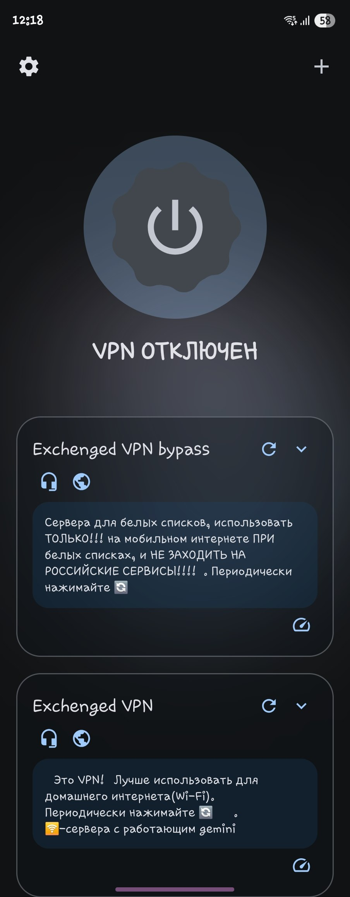
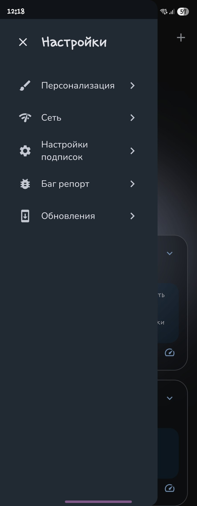
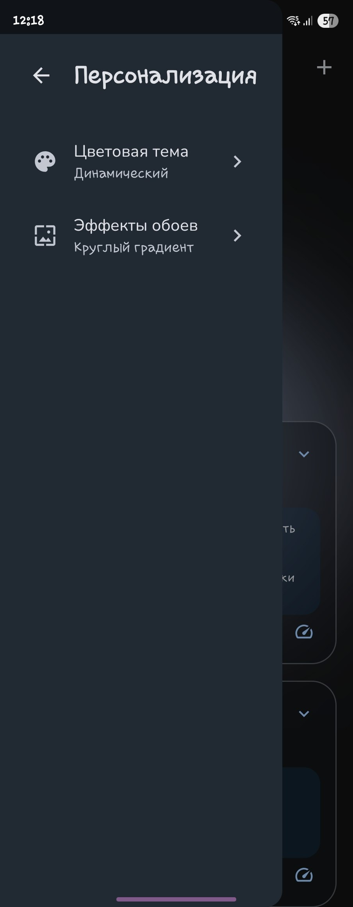
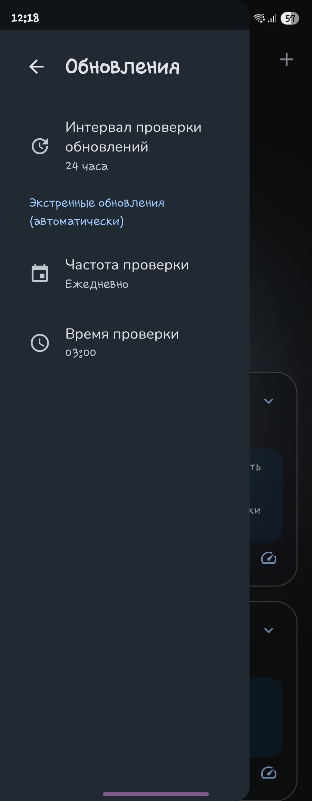

# 🚀 Exchenged Client

**Современный, мощный и удобный Android‑клиент для [Xray‑core](https://github.com/XTLS/Xray-core).**

Exchenged Client обеспечивает безопасное и быстрое прокси‑подключение с акцентом на простоту и производительность.

---

## 📸 Скриншоты

    <h3>Интерфейс для телефона</h3>
    
    
    
    

---

## ✨ Возможности

### 📡 Поддержка протоколов
| VLESS | VMESS | Shadowsocks | Trojan | Hysteria2 |
| :---: | :---: | :---: | :---: | :---: |
| ✅ | ✅ | ✅ | ✅ | ✅ |

### 🛠️ Основные функции
*   **Управление подписками**: простой импорт, управление и пакетное обновление ссылок подписок.  
*   **Интуитивная панель управления**: чистый мониторинг статуса подключения, скорости и трафика в реальном времени.  
*   **Расширенные настройки**: продвинутые правила маршрутизации и настройки DNS для продвинутых пользователей.  
*   **Удобный UX**: Обнавленный интерфейс в стиле material design 3 и разработанный специально для этого приложения emoji workshop  
*   **Стабильный «движок»**: построен на актуальной версии **Xray‑core** для максимальной совместимости и безопасности.  

---

## 📥 Скачать

Готовы начать работу?  

    

* Скачайте .apk файл из раздела Releases или нажмите на кнопку выше.\

* Установите .apk в соответствии с архитектурой вашего устройста или скачайте universal.

---

## 🔨 Сборка из исходников

### Предварительные требования
* **Android Studio**: последняя стабильная версия.  
* **JDK**: 11 и выше.  
* **Go (Golang)**: 1.21+ (требуется для сборки Xray‑core).  
* **Git**: для клонирования подмодулей.  

### Шаги сборки

1.  **Клонируйте репозиторий** (вместе с подмодулями):
    `
    git clone --recursive https://github.com/Lonnory/Exchenged-Client.git
    cd Exchenged-Client
    `
    *Если пропустили подмодули:* `git submodule update --init --recursive`

2.  **Откройте в Android Studio**:
    Выберите папку `Exchenged-Client` и дождитесь завершения синхронизации Gradle.

3.  **Соберите и запустите**:
    Подключите устройство и нажмите **Shift + F10**.

> [!CAUTION]
> 🚨 **ВАЖНО**: для корректного тестирования производительности установите конфигурацию сборки в режим **RELEASE**. [Подробнее о производительности Compose](https://medium.com/androiddevelopers/why-should-you-always-test-compose-performance-in-release-4168dd0f2c71).

---

## 📖 Быстрый старт

1.  **Импорт конфигурации**:
    *   Нажмите кнопку **+**, чтобы импортировать из буфера обмена (`vless://`, `vmess://`, и т.д. А так же подписки).  
    *   Или отсканируйте **QR‑код**.  

2.  **Управление подписками**:
    *   Все подписки выведены на главный экран в виде отдельных карточек, "как в Happ".  

3.  **Подключение**:
    *   Выберите сервер и нажмите **кнопку-действие (FAB)**.  
    *   Подтвердите запрос разрешения VPN.  

---

## 🔗 Благодарности и указания

Особая благодарность проектам:
*   [Xray‑core](https://github.com/XTLS/Xray-core) — базовый сетевой «движок».  
*   [AndroidLibXrayLite](https://github.com/2dust/AndroidLibXrayLite)  
*   [hev‑socks5‑tunnel](https://github.com/heiher/hev‑socks5‑tunnel)  
*   [XrayFa](https://github.com/Q7DF1/XrayFA) - «База» на которой основан Exchenged Client

---
**Если вам нравится проект, не забудьте поставить ⭐! Спасибо😘**
---

## 📄 Лицензия

Распространяется под лицензией **GPL-3.0 license**. Подробности в файле [LICENSE](LICENSE).

---

### 🌟 История звёзд

